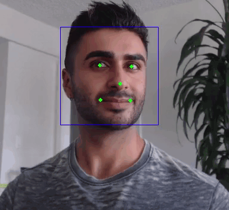

# Trueface SDK C++ Sample App
## Landmark Detection
This sample app demonstrates how to detect facial landmarks and bounding boxes using the SDK. 
The landmarks and bounding boxes are drawn on the video obtained from the users webcam.

## Demo

