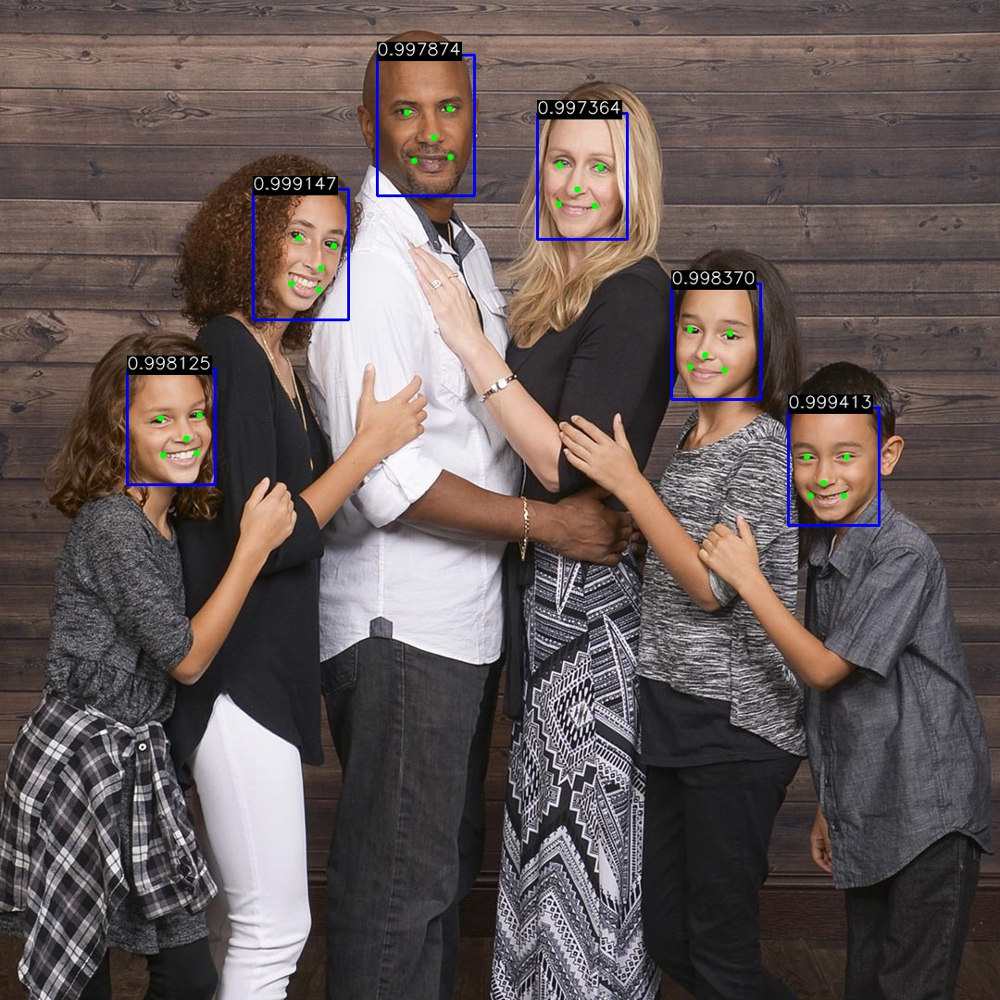
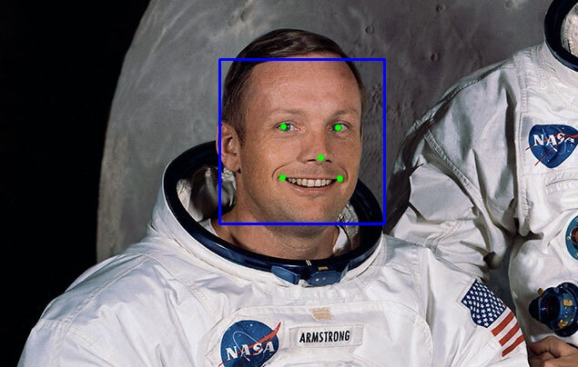
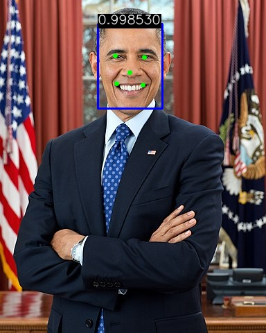
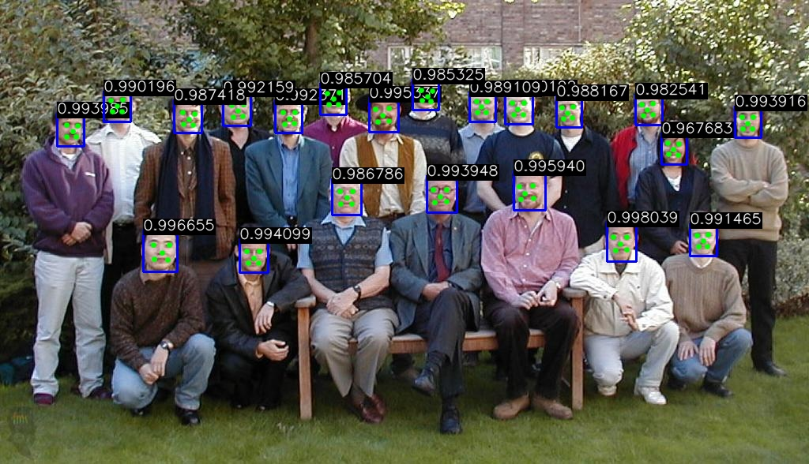

# Trueface SDK C++ Sample App
## Landmark Detection - Draw Landmarks and Save Images
This sample app demonstrates how to detect facial landmarks and bounding boxes using the SDK.
Images are loaded from a provided directory. The facial landmarks and face scores are drawn onto the images, then the images are saved to the run directory. 

# Demo

### Prerequisites
Must have OpenCV installed.

### Build Instructions
* Place Trueface header files in `../../trueface_sdk/include/` and trueface libraries in `../../trueface_sdk/lib/`
* Export your Trueface token to your environment as `TRUEFACE_TOKEN`.
  Alternatively, open the `CMakeLists.txt` file and edit this line here: `add_definitions(-DTRUEFACE_TOKEN="YOUR_TOKEN_HERE")`.
  Replace `YOUR_TOKEN_HERE` with the license token you were provided with. If you have not yet received a token, contact support@pangiam.com.
* `mkdir build && cd build`
* `cmake ..`
* `make`
