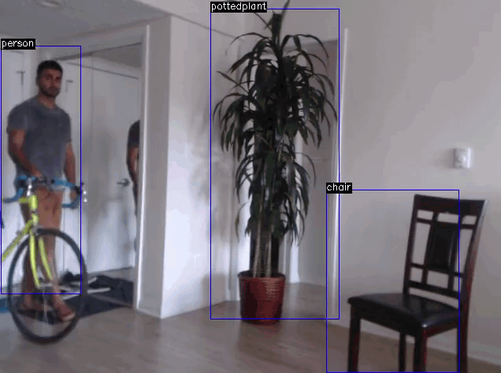

# Trueface SDK C++ Sample App
## Object Detection
This sample app demonstrates how to detect objects using the SDK. The object labels are drawn on the video stream.

# Demo

### Prerequisites
Must have OpenCV installed with the `Video I/O` module built. 

### Build Instructions
* Place Trueface include files and `libtf.a` in `../../trueface_sdk/`
* replace `<LICENSE_CODE>` with your license code in `src/main.cpp`
* `mkdir build && cd build`
* `cmake ..`
* `make`

### Notes
This sample was built with SDK version 0.2